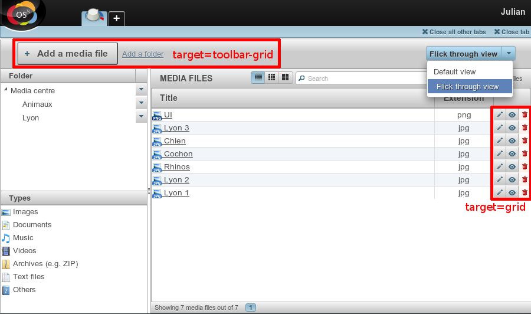
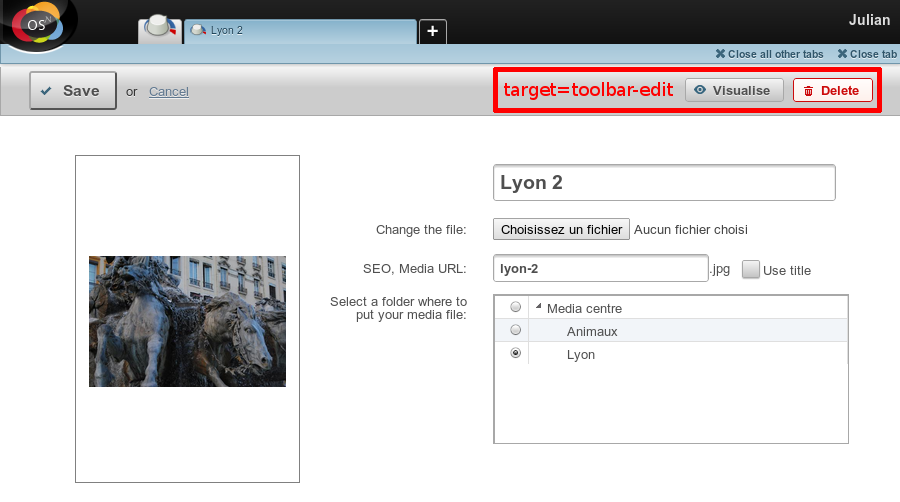

Ajouter une action en back-office
#################################

Les actions sont définies dans le fichier :file:`config/common/{{model}}.config.php`.

Le meilleur moyen est de s'inspirer des actions par défaut qui existent dans Novius OS.

Placeholders
************

La configuration des actions contient des ``{{placeholders}}``.

- Sont remplacés en **PHP** :

    - ``{{model_label}}`` : le nom du modèle
    - ``{{controller_base_url}}`` : l'URL du contrôleur associé au modèle

- Sont remplacé par l'**App Desk** (en JavaScript) :
    - ``{{context}}`` : contexte actuellement affiché (ou premier contexte lorsque plusieurs sont affichés)

Tous les autes placeholders sont remplacés par les données de **l'item** : ``{{_id}}`` et ``{{_title}}`` dans ce cas,
mais égalements n'importe quelle champ définit dans le ``data_mapping``.

Cibles des actions
******************

Il y a 3 cibles possibles pour les actions :

- **toolbar-grid** : barre d'outils de l'appdesk
- **grid** : ligne d'item dans la grille principale de l'appdesk
- **toolbar-edit** : barre d'outils sur le formulaire d'ajout / édition

Add / Edit / Delete
*******************

L'action **add** :

- ouvre un nouvel onglet ;
- fait appel à la méthode ``action_insert_update()`` du contrôleur ``Nos\Media\Controller_Admin_Media`` ;
- avec un paramètre ``$_GET['context']`` qui permet de pré-sélectionner le contexte actif ;
- s'affiche uniquement dans la barre d'outils de l'App Desk.

L'action **edit** :

- ouvre l'onglet d'édition (la méthode n'étant pas précisée pour ``nosTabs``, la valeur par défaut ``open`` sera
  utilisée : elle donnera le focus à l'onglet existant s'il est déjà ouvert, ou en créera un nouveau le cas échéant) ;
- fait appel à la méthode ``action_insert_update( $id )`` du contrôleur ``Nos\Media\Controller_Admin_Media`` ;
- avec un paramètre ``id`` passé à la méthode ;
- s'affiche uniquement dans la grille principale.

L'action **delete** :

- fait appel à la méthode ``action_delete( $id )``  du contrôleur ``Nos\Media\Controller_Admin_Media`` ;
- avec un paramètre ``id`` passé à la méthode ;
- s'affiche à la fois dans la grille principale et sur le formulaire d'édition, mais uniquement pour les items
  existants (pas lors de l'ajout).

.. code-block:: php
   :emphasize-lines: 5,23,42

    <?php

    return array(

        // Acion par défaut ADD
        'add' => array(
            'label' => __('Add {{model_label}}'),
            'primary' => true,
            // Le clic ouvrira un nouvel onglet
            'action' => array(
                'action' => 'nosTabs',
                'method' => 'add',
                'tab' => array(
                    'url' => '{{controller_base_url}}insert_update?context={{context}}',
                ),
            ),
            // L'action sera affichée uniquement dans la barre d'outils de l'App Desk
            'targets' => array(
                'toolbar-grid' => true,
            ),
        ),

        // Action par défaut EDIT
        'edit' => array(
            'label' => __('Edit'),
            'primary' => true,
            'icon' => 'pencil',
            // Le clic ouvrira (ou rendra le focus) l'item
            'action' => array(
                'action' => 'nosTabs',
                'tab' => array(
                    'url' => "{{controller_base_url}}insert_update/{{_id}}",
                    'label' => '{{_title}}',
                ),
            ),
            // L'action s'affiche uniquement dans la grille principale
            'targets' => array(
                'grid' => true,
            ),
        ),

        // Action par défaut DELETE
        'delete' => array(
            'label' => __('Delete'),
            'primary' => true,
            'icon' => 'trash',
            'red' => true,
            // Le clic ouvrira une popup de confirmation
            'action' => array(
                'action' => 'confirmationDialog',
                'dialog' => array(
                    'contentUrl' => '{{controller_base_url}}delete/{{_id}}',
                    'title' => strtr($config['i18n']['deleting item title'], array(
                        '{{title}}' => '{{_title}}',
                    )),
                ),
            ),
            // L'action s'affiche à la fois dans la grille principale et sur le formulaire d'édition
            'targets' => array(
                'grid' => true,
                'toolbar-edit' => true,
            ),
            /// Mais pas pour les nouveaux items !
            'visible' => function($params) {
                return !isset($params['item']) || !$params['item']->is_new();
            },
        ),
    );
