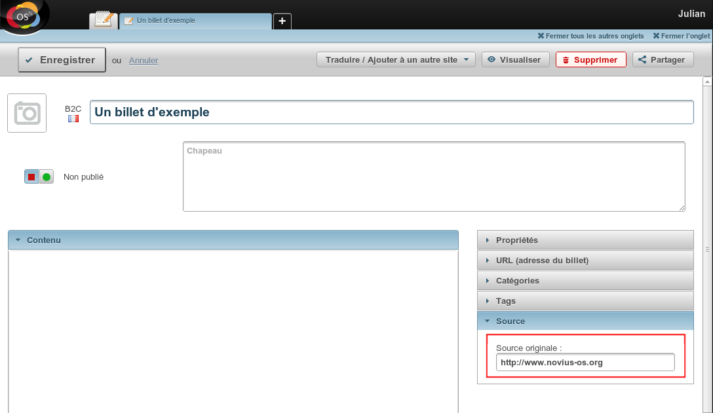

Ajouter un champ
################

Nous allons partir d'un exemple pour l'explication.

Ajoutons un champ ``Source`` pour un billet de blog, qui permettra de renseigner une URL externe ayant produit le
contenu original.

Dans la BDD
***********

.. code-block:: sql

    ALTER TABLE `nos_blog_post` ADD `post_source` VARCHAR(255);

Dans le Model
*************

Deux possibilités :

* Déclarer la nouvelle colonne dans les ``properties`` du model.
* Activer le système de cache des ``properties`` des models.

Déclarer la colonne
===================

Pour déclarer votre nouvelle colonne nous allons écouter l'événement qui charge le fichier de configuration du model.

.. code-block:: php

    <?php

    Event::register_function('config|noviusos_blog::model/post', function(&$config) {
        $config['properties']['post_source'] = array(
            'default' => null,
            'data_type' => 'varchar',
            'null' => false,
        );
    });

.. seealso::

    `Définition des properties dans la documentation de FuelPHP <http://fuelphp.com/docs/packages/orm/creating_models.html#/propperties>`__

Activer le cache des ``properties``
===================================

* Créez le fichier :file:`local/config/config.php` à partir du fichier :file:`local/config/config.php.sample` si ce n'est pas encore fait.
* Décommentez la ligne (ou créez la) ayant la clé ``cache_model_properties`` et lui assigner ``true`` :

    .. code-block:: php

        <?php

        return array(
            //...

            'novius-os' => array(
                //...
                'cache_model_properties' => true,

                //...
            ),
        );

Une fois activé, le système va mettre toutes les ``properties`` des models en cache dans le répertoire :file:`local/cache/fuelphp/model_properties/`.
Quand une colonne est ajoutée et non déclarée, au premier appel à ``get()`` ou à ``set()`` pour cette colonne,
les ``properties`` seront mise à jour avec une requête en base pour lister les colonnes du model.

.. warning::

    Ce mécanisme n'est possible qu'avec une base de données MySQL.

.. seealso::

    :ref:`La documentation sur la configuration de Novius OS <api:php/configuration/software>`.

Dans le formulaire
******************

Le formulaire d'ajout / édition d'un billet de blog est définit dans sa configuration CRUD. Pour l'étendre, nous allons
utiliser un évènement !

Dans le fichier :file:`local/bootstrap.php` (créez-le si nécessaire) :

.. code-block:: php

    <?php

    Event::register_function('config|noviusos_blog::controller/admin/post', function(&$config) {

        // Ajout du champ 'post_source' de type 'text'
        $config['fields']['post_source'] = array(
            'label' => 'Source originale :',
            'form' => array(
                'type' => 'text',
                'placeholder' => 'http://',
            ),
        );

        // Affichage du champ dans le formulaire
        // Nous créons une entrée intitulée 'Source' dans le menu de droite
        $config['layout']['menu']['Source'] = array('post_source');
    });

Le formulaire possède désormais un champ éditable supplémentaire, comme vous pouvez le voir ci-dessous :

Dans la visualisation
*********************

Pour la vue, nous créer le fichier :file:`local/views/apps/noviusos_blognews/front/post/content.view.php`

.. code-block:: html+php

    <?php

    // On inclut le fichier d'origine (qui affiche le contenu)
    include APPPATH.'/applications/noviusos_blognews/views/front/post/content.view.php';

    // On rajoute la source à la fin
    if (!empty($item->post_source)) {
        ?>
        

            <?= __('Source:') ?>
            <a href="<?= htmlspecialchars($item->post_source) ?>">
                <?= htmlspecialchars($item->post_source) ?>
            </a>
        

        <?php
    }

