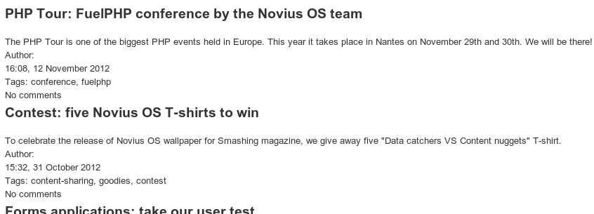

Modifier l'affichage sur le site
################################

Nous allons partir d'un exemple pour l'explication.

Sur le site `Novius OS <http://www.novius-os.org>`__ nous avons personnalisé l'affichage des billets de blog. Voyons-voir comment
cela fonctionne.

Apparence par défaut de l'application blog :

Apparence sur le site Novius OS.org (notre objectif) :

.. image:: images/blog_display_custom.png
	:alt: Vue liste modifiée de l'application 'Blog'
	:align: center

Modification de la vue
**********************

1\ :sup:`ère`\  technique : étendre la vue
==========================================

Grâce à la cascade du système de fichiers, on peut copier le fichier original
:file:`noviusos_blognews::views/front/post/item.view.php` dans notre dossier :file`local` :
:file:`local::views/apps/noviusos_blognews/front/post/item.view.php`

.. code-block:: html+php

    

        

            <?= \View::forge('noviusos_blognews::front/post/title', array('item' => $item)) ?>
            <?= \View::forge('noviusos_blognews::front/post/summary', array('item' => $item)) ?>
        

        

            <?= \View::forge('noviusos_blognews::front/post/publication_date', array('item' => $item)) ?>
            <?= \View::forge('noviusos_blognews::front/post/tags', array('item' => $item)) ?>
        

    

Nous avons supprimé l'affichage de la vignette, de l'auteur, des catégories et du nombre de commentaires.

2\ :sup:`e`\  technique : étendre la configuration
==================================================

L'application blog permet dans sa configuration de désactiver l'affichage de certains éléments. En ce qui nous
concerne, c'est possible pour tous ceux qu'on souhaite ne pas afficher, sauf pour la vignette.

Lorsqu'on utilise le fichier de configuration de l'application blog, cette dernière modifie l'affichage à la fois dans
la liste des billets, mais également sur la fiche, ce qui ne nous convient pas dans notre cas (cette technique est donc
montrée ici à titre d'exemple).

Grâce à la cascade du système de fichiers, on peut copier le fichier original
:file:`noviusos_blognews::config/config.php` dans notre dossier :file:`local` :
:file:`local::config/apps/noviusos_blognews/config.php` :

.. code-block:: php

    <?php

    // On laisse uniquement les clés que l'on souhaite modifier
    return array(
        'categories' => array(
            'show' => false,
        ),
        'authors' => array(
            'show' => false,
        ),
        'comments' => array(
            'show' => false,
        ),
    );

Ajout du CSS
************

1\ :sup:`ère`\  technique : étendre la vue
==========================================

Nous créer le fichier :file:`local::views/apps/noviusos_blognews/front/post/list.view.php`

.. code-block:: php

    <?php

    // On ajoute notre fichier CSS spécifique
    \Nos\Nos::main_controller::addCss('static/css/blog_custom.css');

    // On inclut le fichier d'origine (qui affiche la liste des billets)
    include APPPATH.'applications/noviusos_blognews/views/front/post/list.view.php';

Notre vue modifiée inclut d'abord un fichier CSS (à créer dans :file:`public/static/css/blog_custom.css`, puis appelle la vue d'origine.

2\ :sup:`e`\  technique : agir directement sur le gabarit
=========================================================

Il est également possible d'inclure le fichier CSS via l'évènement ``front.start``, mais dans ce cas, il le sera sur
toutes les pages de votre site, et pas seulement sur la page blog.

Dans le fichier :file:`local/bootstrap.php` (créez-le si nécessaire) :

.. code-block:: php

    <?php

    // Événement qui se déclenche lorsqu'on charge une page du site
    Event::register('front.start', function() {
        \Nos\Nos::main_controller::addCss('css/blog_custom.css');
    });

Dans le cas du site `Novius OS <http://www.novius-os.org>`__, nous avons créés nos gabarits spécialement pour le site, ils incluent directement le
CSS nécessaire à la personnalisation de l'affichage du blog.

