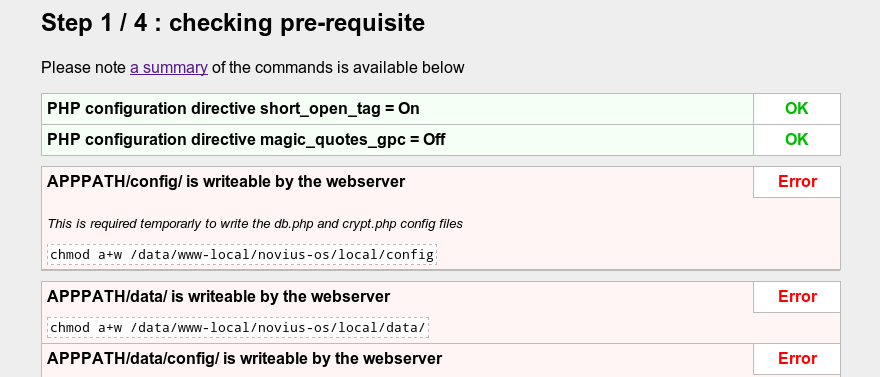
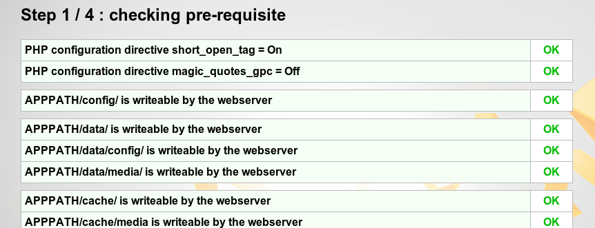
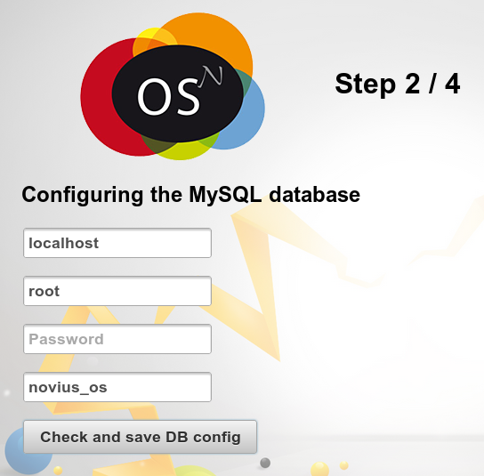
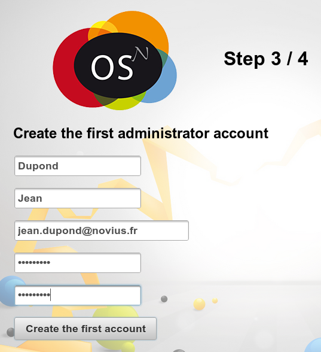
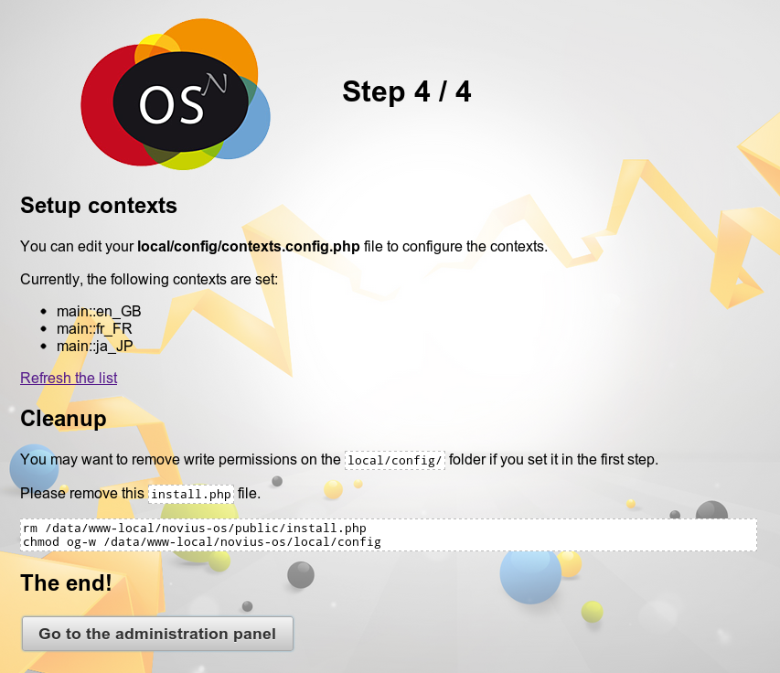
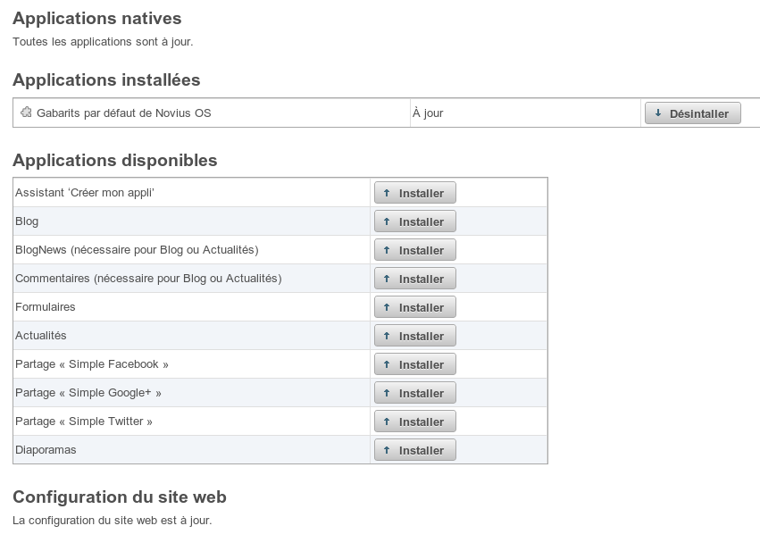
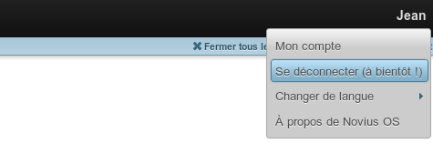

Assistant de paramétrage
========================

Vous avez suivi la :doc:`première étape de l'installation <install>`. Les fichiers de Novius OS sont donc installés, le serveur paramétré et vous accédez à http://votredomaine/novius-os/. Le plus dur est passé, la partie simple commence :-).

Étape 1 : Vérifier les prérequis
-------------------------------------

Cette étape devrait être une simple formalité si vous avez installé Novius OS avec la procédure d'installation rapide. Dans les autres cas, si vous voyez beaucoup de rouge, ne vous inquiétez pas ! Le site a juste besoin de droits en écriture dans certains répertoires. Cette étape vous donne des explications et les commandes à exécuter pour corriger tous les points.

Si vous ne voulez pas vous embêter, copiez / collez le résumé des commandes disponibles en bas de la page dans un terminal : c'est fini !

Étape 2 : Configurer la base de données MySQL
---------------------------------------------

Vous avez besoin d'une base MySQL avec un utilisateur ayant les droits nécessaires. Dans le cas d'un hébergement mutualisé, ces paramètres ont dû vous être fournis par votre hébergeur. Dans les autres cas, voici un exemple pour une base en ``localhost`` :

.. code-block:: sql

    CREATE DATABASE `nom_de_votre_base` DEFAULT CHARACTER SET utf8 COLLATE utf8_general_ci;
    GRANT ALL PRIVILEGES ON `nom_de_votre_base`.* TO 'nom_de_votre_utilisateur'@localhost IDENTIFIED BY 'mot_de_passe';
    FLUSH PRIVILEGES;

Remplissez ces quatre champs en fonction de la configuration de votre base :

Ceci va créer deux fichiers *local/config/db.php* et *local/config/crypt.php* et, surtout, les tables nécessaires dans votre base de données.

Étape 3 : Créer le premier compte administrateur
------------------------------------------------

Étape 4: Terminer l'installation
--------------------------------

Applications
------------

Vous arrivez sur le gestionnaire d'applications. C'est ici que vous installez les applications dont vous avez besoin.

Se déconnecter / connecter
--------------------------

Pour vous déconnecter de l'interface d'administration, cliquez en haut à droit sur votre prénom. Un menu apparait alors :

Vous être alors redirigé sur le formulaire de connexion.

.. image:: images//setup_wizard//step-login-b.png
	:alt: Se connecter
	:align: center