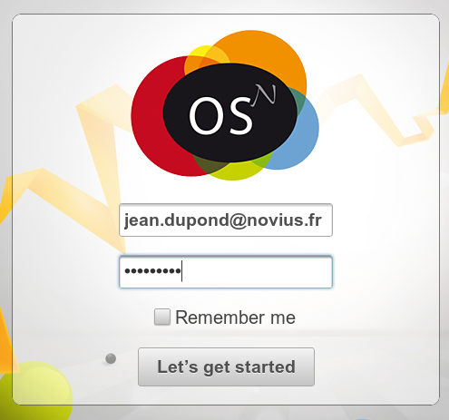

Assistant de paramétrage
========================

Les :doc:`fichiers de Novius OS sont installés, le serveur paramétré <install>`, le plus dur est passé, on commence la partie simple :-)

Dans votre navigateur préféré, appelez la page install.php de votre Novius OS et laissez vous guider par l'assistant :

* http://localhost/nom_du_site si vous avez suivi la procédure d'installation locale
* http://www.votredomaine.com/install.php pour une installation classique sur un serveur externe
* http://www.votrehébergement.com/rep-novius-os/install.php pour une installation dans un sous-répertoire d'un hébergement mutualisé

Étape 1 : vérification des pré-requis
-------------------------------------

Cette étape peut-être une simple formalité si vous avez installé Novius OS avec la procédure d'installation locale. Dans les autres cas, si vous voyez beaucoup de rouge, ne vous inquiétez pas ! Le site a juste besoin de droits en écriture dans certains répertoires. Cette étape vous donne des explications et les commandes à exécuter pour corriger tous les points.

.. image:: images//step-1a.png
	:alt: Étape 1a
	:align: center

Si vous ne voulez pas vous embêter, copiez / collez le résumé des commandes disponibles en bas de la page dans un terminal : c'est fini !

.. image:: images//step-1b.png
	:alt: Étape 1b
	:align: center

Étape 2 : configurer la base de données MySQL
---------------------------------------------

Prérequis à cette étape, avoir créé une base dans MySQL avec un utilisateur associé ayant les droits dessus. Dans le cas d'un hébergement mutualisé, ces paramètres ont dû vous être fournis par votre hébergeur. Dans les autres cas, voici un exemple pour une base en ``localhost``.

.. code-block:: sql

    CREATE DATABASE `nom_de_votre_base` DEFAULT CHARACTER SET utf8 COLLATE utf8_general_ci;
    GRANT ALL PRIVILEGES ON `nom_de_votre_base`.* TO 'nom_de_votre_utilisateur'@localhost IDENTIFIED BY 'mot_de_passe';
    FLUSH PRIVILEGES;

Remplissez simplement les 4 champs en fonction de votre configuration. Prenez note que la base de données doit exister, et que vous aurez peut-être besoin de la créer avant de continuer.

.. image:: images/step-2.png
	:alt: Étape 2
	:align: center

Ceci va créer les 2 fichiers *local/config/db.php* et *local/config/crypt.php* et surtout créer les tables nécessaires dans votre base de données.

Étape 3 : créer le premier compte administrateur
------------------------------------------------

.. image:: images//step-3.png
	:alt: Étape 3
	:align: center

Étape 4: terminer l'installation
--------------------------------

.. image:: images//step-4.png
	:alt: Étape 4
	:align: center

Applications
------------

Vous devriez arriver sur le gestionnaire d'applications. C'est ici que vous pouvez installer les applications que vous souhaitez utiliser.

.. image:: images//step-appmanager.png
	:alt: Applications manager
	:align: center

Se déconnecter / connecter
------------------------

Pour vous déconnecter de l'interface d'administration, cliquez en haut à droit sur votre prénom. Un menu apparait alors,

.. image:: images//step-login-a.png
	:alt: Se déconnecter
	:align: center

Vous être alors redirigé sur le formulaire de connexion.

