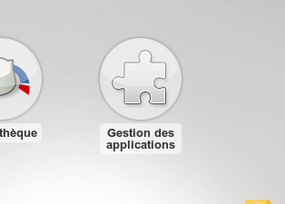

Applications
============

Les applications permettent de rajouter des fonctionnalités à Novius OS.

Le gestionnaire d'applications
------------------------------

Permet d'installer / désinstaller des applications.

Pour y accéder, cliquez sur le launcher Gestion des applications.

Une interface apparaît alors vous permettant d'installer / mettre à jour / désinstaller vos applications.

.. image:: images/applications/application-manager.png
	:alt: Le gestionnaire d'applications
	:align: center