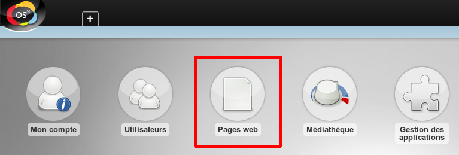
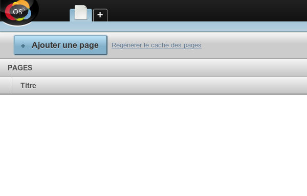
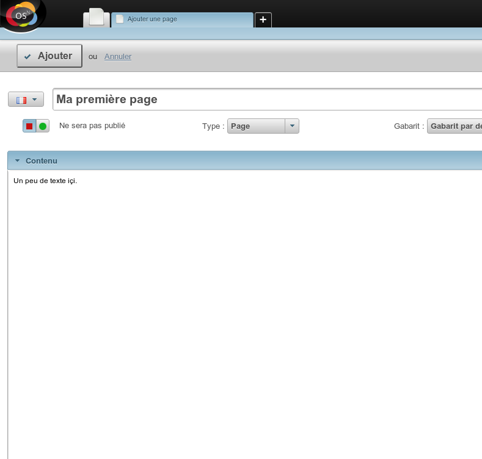
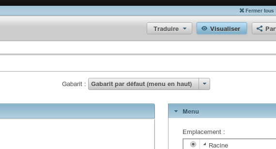
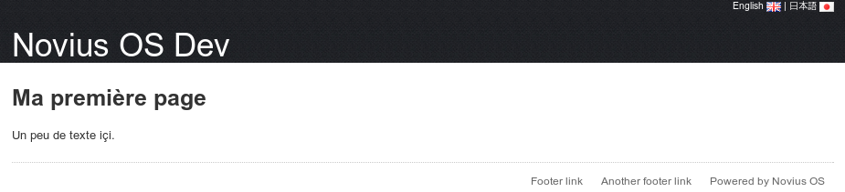

Première page
=============

Ouvrir l'application Pages web
------------------------------

Si vous voulez créer un site web, vous devez utiliser l'application **Pages web** :

Ajouter une page (votre première)
---------------------------------

Écrire du contenu et cliquer « Ajouter »
----------------------------------------

Aperçu de votre travail
-----------------------

L'action **Visualiser** vous permet d'avoir un aperçu de la page avant qu'elle ne soit publiée.

Publier votre page
------------------

Une fois que vous êtes satisfait du contenu, choisissez « Sera publié » et enregistrez.

Admirez le travail remarquable que vous venez de faire :

