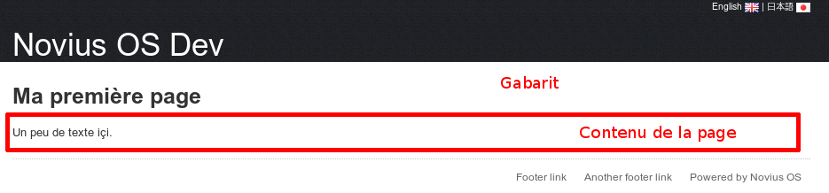
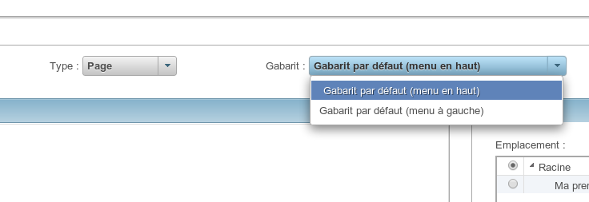

Gabarits
========

Les pages ont besoin de gabarits qui englobent le contenu ajouté en back-office et définissent le style.

Au moment d'ajouter ou modifier une page, on précise son gabarit.

Il est aussi possible d'ajouter de nouveaux gabarits. Les gabarits sont embarqués avec les applications. Ajouter un gabarit passe donc par l'ajout d'une application (via le :doc:`gestionnaire d'application <applications>`).