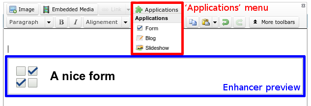

Metadata
########

The :file:`metadata.config.php` file is how an application is defined. It tells what contains the application and what
it does.

The most important keys are:

:name: The name of the application.
:namespace: In which PHP namespace all the classes of the application must be defined.
:icons: In the 3 standard sizes 16*16, 32*32 and 64*64.
:requires: Optional. Which applications does your application requires. Array or string (in the last case, considered as an array
    with a unique element).
:extends: Optional. Application can extend other applications. Extend mechanism can extended config file, lang file and views.

.. code-block:: php

    <?php

    return array(
        'name'      => 'Webpages',
        'namespace' => 'Nos\Page',
        'version'   => '0.2',
        'provider'  => array(
            'name'  => 'Novius OS',
        ),
        'extends' => array(
            // Optional,
        ),
        'requires' => array(
            // Optional
        ),
        'icons' => array(
            64 => 'static/apps/noviusos_page/img/64/page.png',
            32 => 'static/apps/noviusos_page/img/32/page.png',
            16 => 'static/apps/noviusos_page/img/16/page.png',
        ),
        'permission' => array(
            // Empty array for now. Leave it.
        ),
        'i18n_file' => 'noviusos_page::metadata',
        'launchers' => array(
            // Optional
        ),
        'enhancers' => array(
            // Optional
        ),
        'templates' => array(
            // Optional
        ),
        'data_catchers' => array(
            // Optional
        ),
    );

An application provides:

.. _php/configuration/metadata/extends:

Extends
=======

An application can extend multiple others applications.

An application that extends an other application will be loaded when the extended application is loaded.

Configuration and language files of an extended application can be extended by an application that extends.
Views can be replaced.

To proceed, put extended files in subdirectory :file:`apps/application_extended`.

| **Example**: the ``app_a`` application extends ``app_b`` application, especially :file:`config/common.config.php`, :file:`lang/common.lang.php` and :file:`views/common.view.php`.
| Files structure will be:

* :file:`local/applications/app_a/`

    * :file:`config/apps/app_b/common.config.php`
    * :file:`lang/apps/app_b/common.lang.php`
    * :file:`views/apps/app_b/common.view.php`

.. _php/configuration/metadata/launchers:

Launchers
=========

A :term:`launcher <Launcher>` is an icon on the home tab.

A launcher is defined by an associative array. Key is launcher ID, launcher properties is an associative array:

:name: Text to display for the icon.
:icon: Optional. URL to a 64*64 image, default will use the 64*64 icon of the app.
:action: What is done when clicking on the launcher. See :ref:`php/configuration/application/nosActions`.

.. code-block:: php

    <?php

    return array(
        'launchers' => array(
            'noviusos_page' => array(
                'name' => 'Webpages',
                // 'icon' is not set, so the default icon will be used
                'action' => array(
                    // open a tab
                    'action' => 'nosTabs',
                    'tab' => array(
                        'url' => 'admin/noviusos_page/appdesk/index',
                        // 'iconUrl' is not set, so the default icon will be used
                    ),
                ),
            ),
        ),
    );

.. _metadata/enhancers:

Enhancers
=========

:term:`Enhancers <Enhancer>` are used in WYSIWYG editors. They provide functionalities for the front-office.

For example, the ‘Forms’ application allows users to insert forms in their web pages (using an enhancer).

:term:`URL enhancers <URL Enhancer>`, a specific type of enhancers, handle their own URLs. For example, every blog post
has an URL.

An enhancer is defined with:

:title:             Title of the enhancer displayed when opening the ‘Application’ menu from the wysiwyg.
:desc:              Optional. Description of the enhancer.
:iconUrl:           Optional. URL to a 16*16 icon, displayed when opening the ‘Application’ menu from the wysiwyg, default
  		            will use the 16*16 icon of the app ;
:enhancer:          URL of the front-office controller used to render the enhancer.
:urlEnhancer:       Same that ``enhancer``.Only one of the two keys can is used, depending if you want an URL enhancer or
                    just a plain regular enhancer.
:previewUrl:        Optional. URL of the controller used to render the preview in the wysiwyg.
:dialog:            Optional. If you want a configuration popup, URL of the controller used to display and save the
  		            enhancer configuration. See :js:func:`$container.nosDialog` for the list of parameters.
:valid_container:   | Optional. A `callback function <http://php.net/manual/en/language.types.callable.php>`__ to check
                      if the enhancer is available for a specific container.
                    | If the function returns false, the enhancer won't be available.
                    | The function takes two parameters: the enhancer's configuration and the :php:class:`container instance <Nos\\Orm\\Model>`.

.. code-block:: php

    <?php

    return array(
        'noviusos_form' => array(
            'title' => 'Form',
            'desc'  => '',
            // Here it's just a regular enhancer
            'enhancer' => 'noviusos_form/front/main',
            //'urlEnhancer' => 'noviusos_form/front/main',
            'iconUrl' => 'static/apps/noviusos_form/img/icons/form-16.png',
            // We'll use our controller to generate the preview
            'previewUrl' => 'admin/noviusos_form/enhancer/preview',
            // And the user has to configure it
            'dialog' => array(
                'contentUrl' => 'admin/noviusos_form/enhancer/popup',
                'width' => 450,
                'height' => 400,
                'ajax' => true,
            ),
            // The callback function which check availability of the enhancer
            'valid_container' => 'validContainer',
        ),
    );

    // In this example, the enhancer won't be available in WYSIWYGs of monkeys.
    function validContainer($enhencer, $container)
    {
        $container_class = get_class($container);
        return $container_class !== 'Nos\Monkey\Model_Monkey';
    }

.. _metadata/templates:

Templates
=========

:term:`Templates <Template>` are similar to other CMS' templates or themes. They provide a layout for the front-office.

In Novius OS, a template contains one or more WYSIWYG editable area(s), which are is placed inside a grid.

The grid has a size of ``cols`` * ``rows``, and each editable area is positioned using absolute coordinates (it's similar
to ``position: absolute`` in CSS).

Each WYSIWYG editable area has:

- a **name**: it's the key in the ``layout`` array (see below) ;
- a **position**: absolute coordinates inside the grid (similar to ``left`` and ``top`` in CSS) ;
- a **size**: similar to ``width`` and ``height`` in CSS.

In the end, a template is defined with:

:file:    path to the template file (it's a view)
:title:   title of the template, it's shown when selecting a template for a page
:cols:    grid width (in units)
:rows:    grid height (in units)
:layout:  list of the WYSIWYG editors inside the grid :

    - the key is the name of the WYSIWYG ;
    - the value is a comma-separated string containing (in this order) :

        - the left position (0-indexed) ;
        - the top position (0-indexed) ;
        - the width (in units) ;
        - the height (in units).

Here's an example:

.. code-block:: php

    <?php

    return array(
        'templates' => array(
            'top_menu' => array(
                'file' => 'noviusos_templates_basic::top_menu',
                'title' => 'Default template with a top menu',
                'cols' => 1,
                'rows' => 1,
                'layout' => array(
                    // There is one WYSIWYG named 'content'
                    // Position inside the grid: <left>,<top>,<width>,<height>
                    'content' => '0,0,1,1',
                ),
            ),
        ),
    );

.. _php/configuration/metadata/data_catchers:

Data catchers
=============

.. todo::
    Voir comment faire pour cette section

