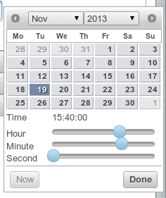

.. _php/renderers/datetime:

Date Time Picker
################

.. php:namespace:: Nos

.. php:class:: Renderer_Datetime_Picker

    | Extends :php:class:`Nos\\Renderer`.
    | This renderer is used to pick a date and time.
    | It's based on `jQuery UI Date Time Picker addon <http://trentrichardson.com/examples/timepicker/>`__.

Configuration
*************

.. php:attr:: wrapper

	HTML string to wrap the ``<input>`` + the generated image to open the datetimepicker

.. php:attr:: format

	(Default: datetime). Format saved and displayed : date or datetime

	.. versionadded:: chiba.2.1

.. php:attr:: datetimepicker

	Options for the datepicker widget used to render the UI. See the
	`jQuery UI documentation <http://api.jqueryui.com/datepicker/>`__ for all available options.

        .. Strange syntax here, we need a dummy text and double-indentation for :labels: to keep the case

        Default values below:

            :showOn: both
            :buttonImage: static/novius-os/admin/novius-os/img/icons/date-picker.png
            :buttonImageOnly: true
            :autoSize: true
            :hiddenTimeFormat: HH:mm:ss
            :hiddenDateFormat: yy-mm-dd
            :dateFormat: HH:mm:ss
            :timeFormat: HH:mm
            :dateFormat: dd/mm/yy
            :altFieldTimeOnly: false
            :showButtonPanel: true
            :changeMonth: true
            :changeYear: true
            :showOtherMonths: true
            :selectOtherMonths: true
            :gotoCurrent: true
            :firstDay: 1
            :showAnim: slideDown

Methods
*******

.. php:method:: renderer($renderer)

	:param Model $renderer:

    	    HTML attributes (``name``, ``class``, ``id``, ``value``, etc.), with a special key ``renderer_options``

	:return: The <input> tag with JavaScript to initialise it

    	Displays a date time picker in a standalone manner.

Example
*******

Adding a date time picker in a CRUD form configuration:

.. code-block:: php

    <?php

    return array(
        'label' => '',
        'renderer' => 'Nos\Renderer_Datetime_Picker',
        'renderer_options' => array(
            'datepicker' => array(),
            'wrapper' => '

',
        ),
    );

Displaying a date time picker:

.. code-block:: php

    <?php

    echo Nos\Renderer_Datetime_Picker::renderer(array(
        'name' => 'my_datetime',
        'class' => 'some_class',
        'value' => '2013-02-13',
        'renderer_options' => array(
            'datetimepicker' => array(),
            'wrapper' => '

',
        ),
    ));