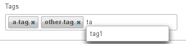

Tag
####

.. php:namespace:: Nos

.. php:class:: Renderer_Tag

	| This renderer is used to add tags on an item.
	| It's based on `jQuery UI Tag-it <http://aehlke.github.com/tag-it/>`__.

Configuration
*************

Any options for the jQuery UI Tag-it widget. See the
`documentation <https://github.com/aehlke/tag-it/blob/master/README.markdown>`__ for all available options.

Example
*******

Adding a tags editor in a CRUD form configuration:

.. code-block:: php

    <?php

    return array(
        'label' => '',
		'renderer' => 'Nos\Renderer_Tag',
		'renderer_options' => array(
			'model'         => 'Model_Tag',
			'label_column'  => 'tag_label',
			'relation_name' => 'tags'
		),
    );
