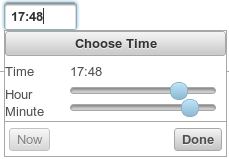

Time Picker
###########

.. php:namespace:: Nos

.. php:class:: Renderer_Time_Picker

	| This renderer is used to pick a time.
	| It's based on `jQuery UI Time Picker <http://trentrichardson.com/examples/timepicker/>`__.

Configuration
*************

All the `jQuery UI Time Picker options <http://trentrichardson.com/examples/timepicker/#tp-options>`__ can be used.

Methods
*******

.. php:method:: renderer($renderer)

	:param Model $renderer:

	    HTML attributes (``name``, ``class``, ``id``, ``value``, etc.), with a special key ``renderer_options``

	:return: The <input> tag with JavaScript to initialise it

	Displays a time picker in a standalone manner.

Examples
********

Adding a time picker in a CRUD form configuration:

.. code-block:: php

    <?php

    return array(
        'label' => '',
        'renderer' => 'Nos\Renderer_Time_Picker',
        'renderer_options' => array(
            // jQuery UI Time Picker options
        ),
    );

Displaying a time picker:

.. code-block:: php

    <?php

    echo Nos\Renderer_Time_Picker::renderer(array(
        'name' => 'my_time',
        'class' => 'some_class',
        'value' => '17:48',
        'renderer_options' => array(
            // jQuery UI Time Picker options
        ),
    ));