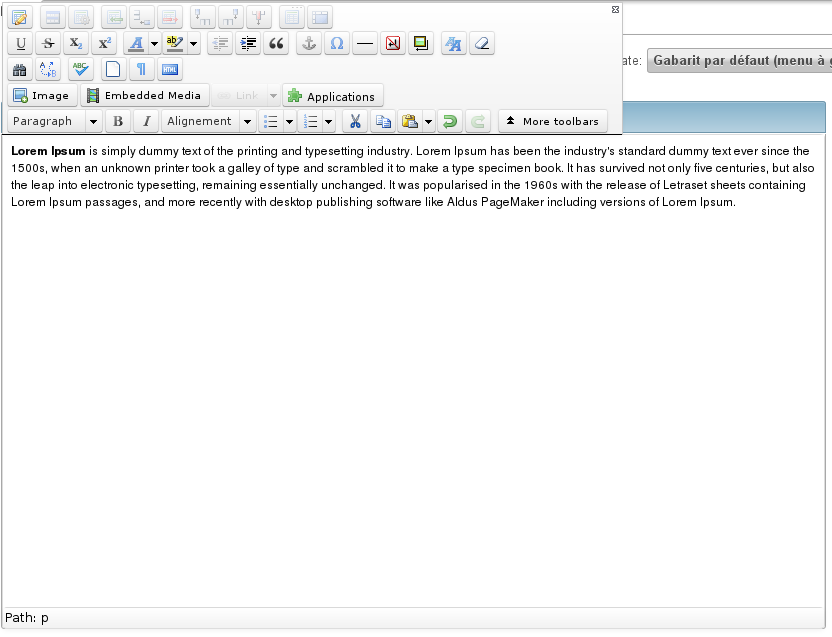

WYSIWYG
#######

.. php:namespace:: Nos

.. php:class:: Renderer_Wysiwyg

	| This renderer is used to display a WYSIWYG editor.
	| It's based on `TinyMCE <http://www.tinymce.com/>`__.

Configuration
*************

Any options for the TinyMCE WYSIWYG editor. See the
`TinyMCE documentation <http://www.tinymce.com/wiki.php/Configuration>`__ for all available options.

Methods
*******

.. php:method:: renderer($renderer)

	:param Model $renderer:

	    HTML attributes (``name``, ``class``, ``id``, ``value``, etc.), with a special key ``renderer_options``

	:return: The <textarea> tag with JavaScript to initialise it

	Displays a TinyMCE WYSIWYG editor in a standalone manner.

Example
*******

Adding a WYSIWYG in a CRUD form configuration:

.. code-block:: php

    <?php

    return array(
        'label' => '',
        'renderer' => 'Nos\Renderer_Wysiwyg',
        'renderer_options' => array(
        	// TinyMCE options
        ),
    );

Displaying a WYSIWYG editor:

.. code-block:: php

    <?php

    echo Nos\Renderer_Wysiwyg::renderer(array(
        'name' => 'my_wysiwyg',
        'value' => '
My contents
',
        'renderer_options' => array(
        	// TinyMCE options
        ),
    ));