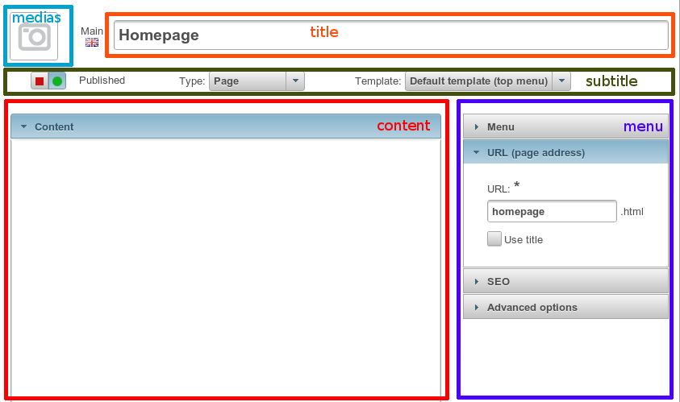

.. _php/views/form/layout_standard:

Standard layout
---------------

View path: ``nos::form/layout_standard``.

**Params**:

:title:    Main fields at the top of the form.
:medias:   Medias are shown at the left of the title.
:large:    Default layout has spaces on the sides. If true, the form will use 100% of the width.
:save:     Which field is the save button.
:subtitle: Fields under title.
:content:  It has the same syntax as the **full** version of the :ref:`crud layout <php/configuration/crud/layout>`.
:menu:     Shown on the right. Data for the **accordion** view (see below). Optionally comes with an **simplified syntax**.

**Standard syntax** for the accordion:

.. code-block:: php

    array(
        'first_accordion' => array(
            'title' => __('My first accordion'),
            'fields' => array('field_1', 'field_2'),
        ),
        'second_accordion' => array(
            'title' => __('My second accordion'),
            'fields' => array('field_3', 'field_4'),
        ),
    ),

- if ``title`` is omitted, it will use the key as default value ;
- if ``fields`` is omitted, it will use the whole array as the list of fields.

(so you can't omit the ``fields`` if you set a ``title``).

**Simplified syntax** for the accordion:

.. code-block:: php

    array(
        __('My first accordion') => array(
            'field_1',
            'field_2',
        ),
        __('My second accordion') => array(
            'field_3',
            'field_4',
        ),
    ),

    // OR

    array(
        __('My first accordion') => array(
            'fields' => array('field_1', 'field_2'),
        ),
        __('My second accordion') => array(
            'fields' => array('field_4', 'field_4'),
        ),
    ),
