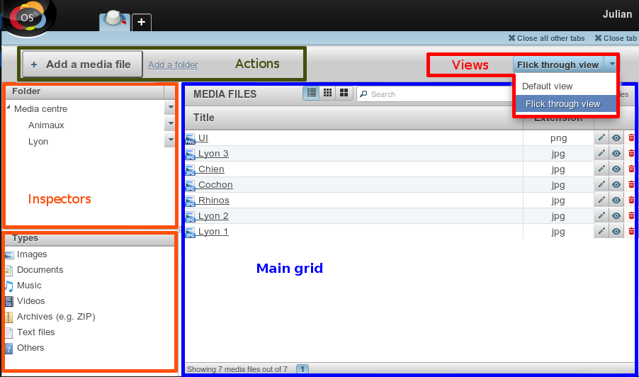

Fondamentaux des applications
=============================

Une application se définit par ses modèles, mais aussi par les contrôleurs et vues associés. Ils dépendent de la nature
de l’application. Néanmoins, certains éléments / principes sont génériques et réutilisables dans tous les cas.

Définition
----------

Pour pouvoir ajouter une application au gestionnaire d'applications, il faut créer un fichier
:file:`metadata.config.php` pour votre application. Ce fichier doit contenir le namespace de l'application, qui doit
être de la forme ``Provider\NomApplication``. Il faut y ajouter le nom de l’application, une version et le provider
(caractérisé au minimum par un nom).

Il est également possible de définir d’autres éléments dans ce fichier metadata :

- **Launchers** : icônes de l'onglet d'accueil permet de lancer une application. Ils sont définis par un nom et une URL
- **Data catchers** : composant d'une application permettant d'exploiter les données partagées par d'autres (dites sharable data)
- **Enhancers** : grâce aux enhancers, une application vient enrichir le contenu édité dans un WYSIWYG.
- **Templates** : modèles de pages pour le front-office.

`Voir aussi l'infographie 'Comprendre les applications' <http://novius-os.github.com/docs/fr/applications.html>`_

L’App Desk
----------

Avant tout, :doc:`consulter les principes ergonomiques <ergonomie>` pour comprendre l'App Desk.

La configuration de l’App Desk
^^^^^^^^^^^^^^^^^^^^^^^^^^^^^^

L’App Desk est caractérisé par plusieurs éléments configurables :

- le type d’affichage des données ;
- les données à afficher ;
- les actions principales et secondaires.

Le :guilabel:`tableau principal` peut proposer plusieurs :guilabel:`vues` (à ne pas confondre avec
le V de MVC) : liste, arborescence ou vignettes.

Ces vues sont définies via des fichiers de configuration, qui précisent les données à afficher ainsi que les
:guilabel:`actions` principales et secondaires.

Les :guilabel:`inspecteurs` sont également définis via des fichiers de configuration. Ils indiquent sur quel attribut ou relation
les données du tableau principal seront triées, ainsi que les actions associées aux éléments de l’inspecteur. À noter
que les inspecteurs sont basés :

- Soit sur le même modèle que celui du tableau principal, l'inspecteur fait alors référence à des attributs (ex :
  date de création pour des billets de blog) ;
- Soit sur un autre modèle (ex : auteur pour des billets de blog).

Contrôleurs, formulaires et modèles
^^^^^^^^^^^^^^^^^^^^^^^^^^^^^^^^^^^

Depuis l’App Desk, il est possible d’appeler des contrôleurs qui réalisent des opérations sur les données concernées.

Certaines opérations s'effectuent directement (ex : la suppression, seule une confirmation est demandée). Elles sont,
dans ce cas, attribuées au contrôleur de l’App Desk.

D'autres opérations appelent une vue et sont alors attribuées au contrôleur du modèle. Généralement, la vue appelée
est un formulaire (ajout / édition). Ce dernier est construit grâce au fichier de configuration du modèle, qui peut
être rempli grâce à une instance du modèle. Le contrôleur est de nouveau appelé lors de l’envoi du formulaire pour
enregistrer les données.

Observers et behaviours
-----------------------

Les observers sont issus du framework `FuelPHP <http://dev-docs.fuelphp.com/packages/orm/observers/intro.html>`_.

Ce sont des procédures liées directement à un modèle. Elles sont appelées lorsque qu'un évènement identifié est
déclenché. Ces procédures sont utilisées pour formatter, modifier ou valider des propriétés du modèle (ex :
reformattage des données avant l'ajout en base de données).

Les behaviours, implémentées pour Novius OS, reprennent et étendent ce principe. Là où les observers effectuent une
action sur une propriété du modèle, les behaviours définissent un ensemble de méthodes qui établissent un comportement
particulier sur le modèle (ex : translatable, publishable). Ces méthodes sont également déclenchées via des évènements.

Ces outils ont pour intérêt de mutualiser des méthodes pour plusieurs modèles distincts.