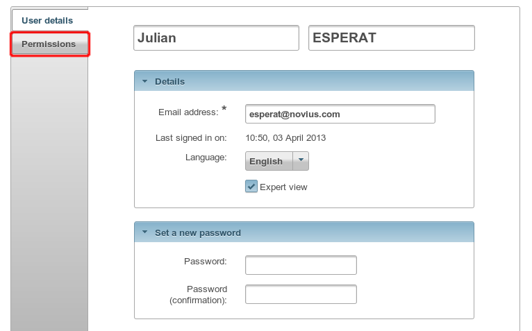
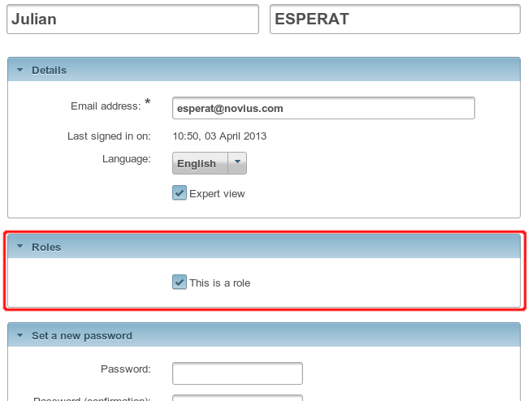
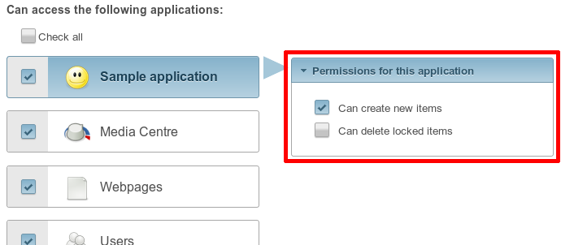

Permissions et droits d'accès
#############################

Rôles (ou "profils")
====================

Les permissions s'appliquent systématiquement sur un rôle. Ensuite, chaque utilisateur se voit attribuer un ou plusieurs
rôles, dont il hérite les droits d'accès.

Un rôle par utilisateur
-----------------------

Pour des raisons de simplicité et de compréhension, dans une installation par défaut :

- ces rôles sont cachés ;
- chaque utilisateur se voit automatiquement attribuer un seul rôle ;
- il n'est pas possible de partager un rôle entre plusieurs utilisateurs.

La notion de rôle s'efface complètement et les droits d'accès se configurent via un onglet dédié sur la fiche d'un
utilisateur :

Plusieurs rôles par utilisateur
-------------------------------

Il est cependant possible d'activer la gestion des rôles multiples dans le fichier de configuration principal :
``novius-os.users.enable_roles = true``.

Une fois activés, il devient donc possible de partager un rôle entre plusieurs utilisateurs. Les permissions peuvent
alors se configurer plus finement :

- sur la fiche d'un utilisateur, l'onglet "Droits d'accès" disparait au profit d'un bloc "Rôles" ;
- l'AppDesk de l'application Utilisateurs s'enrichit :

  - d'un nouvel inspecteur "Rôles" ;
  - une nouvelle action "Ajouter un rôle".

- les droits d'accès se configurent désormais sur la fiche d'un rôle.

Structure d'un droit d'accès
============================

Il existe deux types de droits d'accès :

- les simples : oui ou non ;
- les multiples : applicables sur une liste de catégories.

Le droit **simple** a du sens en lui-même, par exemple "Est-ce que je peux ajouter une page ?" ou encore "Est-ce que je
peux supprimer une page verrouillée ?".

Les droits **multiples** n'ont pas de sens seuls, ils s'expriment uniquement en fonction d'une catégorie. Par exemple,
"Est-ce que je peux écrire dans ce dossier ?" a besoin d'une liste de dossiers sur lesquels s'appliquer, ou bien "Est-ce
que j'ai accès à cette application ?" a besoin de la liste des applications pour s'exprimer.

Un droit **simple** est composé d'une seule colonne ``perm_name``, tandis qu'un droit **multiple** (= droit par
catégorie) est composé de deux colonnes : ``perm_name`` (comme pour le droit simple) et ``perm_category_key``.

Utilisation dans les applications
=================================

Fichier :file:`permissions.config.php`
--------------------------------------

Grâce à ce fichier, chaque application peut définir la liste des permissions qu'elle souhaite configurer.

L'affichage se fait dans une colonne dédiée à droite du nom de l'application lors de l'édition des permissions :

.. seealso:: :ref:`API associée au fichier de configuration des permissions <api:php/configuration/application/permissions>`

API pour vérifier une permission
--------------------------------

.. code-block:: php

    <?php
    // Simple : 1 seul argument, le nom de la permission
    Permission::check('noviusos_app::delete_locked');

    // Multiple (réglable par catégories) : 2 arguments, le nom de la permission + la clé de la catégorie
    Permission::check('noviusos_app::create_in_folder', $folder_id);

.. seealso:: Documentation d'API pour la classe :ref:`Permission <api:php/classes/permission>`.

.. warning::

    Le nom de la permission est un élément important. La partie avant les ``::`` doit représenter un nom d'application
    valide. Pour que la permission soit validée, il faut également que l'utilisateur ait accès à cette application.

CRUD
----

Il est possible de cacher des champs en fonction des permissions. Pour cela, il faut utiliser la clé
:ref:`show_when <api:php/configuration/application/crud/fields>` qui définit une fonction de callback retournant si
le champ doit être visible ou non.

.. code-block:: php
   :emphasize-lines: 9-12

    <?php
    return array(
        'fields' => array(
            'my_field' => array(
                'label' => 'My field',
                'form' => array(
                    'type' => 'text',
                ),
                'show_when' => function() {
                    // The field will only be visible when the user has the requested permission
                    return Permission::check('my_app::my_permission');
                },
            ),
        ),
    );

Actions
-------

Il est possible de désactiver des actions en fonction des permissions grâce à la clé
:ref:`disabled <api:php/configuration/application/common/actions>`.

.. code-block:: php
   :emphasize-lines: 13-17

    <?php
    return array(
        'data_mapping' => array(/*...*/),
        'actions' => array(
            'delete' => array(
                'label' => __('Delete'),
                'primary' => false,
                'icon' => 'home',
                'action' => array(/*...*/),
                'targets' => array(
                    'grid' => true,
                ),
                'disabled' => array(
                    function($item) {
                        return !Permission::check('my_app::can_delete_item') ? __('You don\'t have the permission to delete items.') : false;
                    }
                ),
            ),
        ),
    );

